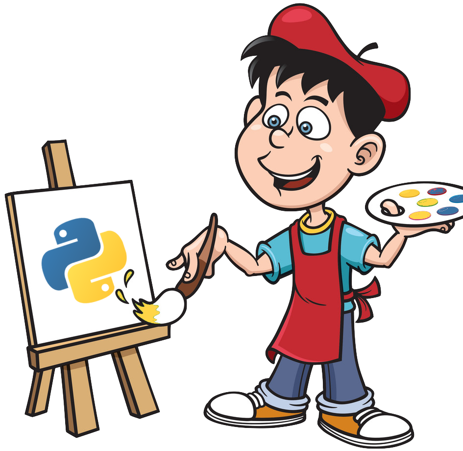

<p align="center">
  <a>
    
    <h1 align="center">Artist.py</h1>
  </a>
</p>

<p align="center">
	<a href="https://github.com/manoloesparta/artist.py/releases">
		
	</a>
  <a>
		
	</a>
  <a>
    
  </a>
</p>

> Another way for discovering new artists

This script generates a new playlist for a selected artist, it applies a lot of filters starting with the word in banned_words.json, it has my default configuration but its made so that everybody can edit it.

**The file artists.json is for personal configuration the default bands are chosed by me but it is intended that you add more artists with the format used in the file, name and Spotify Artist ID**

## Requirements

```
git clone https://github.com/manoloesparta/artist.py
cd artist
pip3 install -r requirements.txt
```
Export some enviroments variables
```
export SPOTIPY_CLIENT_ID='your-spotify-client-id'
export SPOTIPY_CLIENT_SECRET='your-spotify-client-secret'
export SPOTIPY_REDIRECT_URI='your-app-redirect-url'
```

## Usage
Edit the following line with the codename you set up in the artists.json
```python
albums_collected_id, artist = load_albums(Spotify, 'ARTIST_NAME')
```
Exceute with
```
python3 main.py
```

## License
This project is licensed under the MIT License